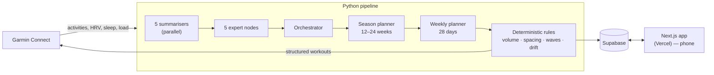
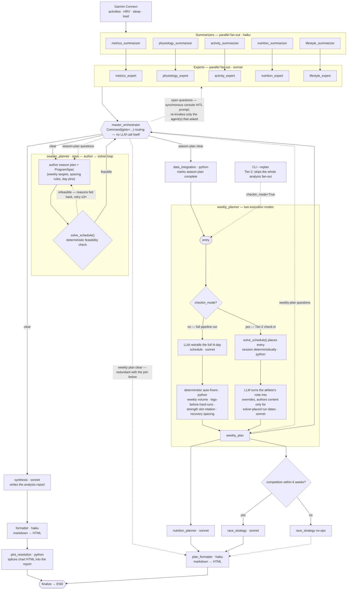

# Athlete Management System

A multi-agent coaching system for hybrid athletes: **strength, endurance,
nutrition and recovery planned as one**, and written back to the watch.

Most training tools do exactly one thing — a running plan, or a lifting log, or
a calorie tracker — and leave the interactions between them to you. Those
interactions are where the hard problems live. Leg volume placed the day before
a quality run degrades both. Fuelling can't be decided without knowing what
session is coming. Recovery data is meaningless unless the planner is allowed to
act on it. This system treats them as one problem, because for the athlete they
are one problem.

[](https://github.com/Verdalingen/athlete-management-system/actions/workflows/ci.yml)
[](https://python.org)
[](web/)
[](LICENSE)

> Not affiliated with Garmin. Not medical advice.

<p align="center">
  
</p>

*The dashboard on a race-week Friday. Readiness derived from the morning's
data, today's session with working weights, the month at a glance, and the
week's intake. All figures here are the seeded demo athlete — see
[Exploring it without a Garmin account](#exploring-it-without-a-garmin-account).*

---

## The loop

A closed loop, not a report generator:

1. **Observe** — pull activities, HRV, sleep, resting HR and body composition
   from Garmin Connect, and compute the load metrics rather than trusting the
   vendor's (EWMA acute/chronic, an uncoupled chronic series, ramp, monotony).
2. **Decide** — a team of specialist agents (metrics, physiology, activity,
   nutrition, lifestyle) run in parallel, feed an orchestrator, and produce a
   season strategy and a concrete 4-week plan.
3. **Act** — structured workouts are written to Garmin Connect and sync to the
   watch: real exercise keys, set counts, rest steps, pace-zone targets.
4. **Measure** — drift detection compares what was planned against what was
   actually done.
5. **Correct** — re-plan from the divergence, on a schedule, unattended.

Steps 3 to 5 are what make it a system rather than a dashboard. It doesn't
advise; it acts, then checks whether the action took.

That closed loop is also why the next section isn't a stylistic preference. You
cannot put an unverifiable component in a control loop that actuates on a
person.

---

## The design principle

**Rules that can be checked mechanically live in Python, not in the prompt.**

Weekly volume caps, leg-day/hard-run spacing, bench-wave progression, slot
rotation, running-session rendering, plan-drift detection — all of it is
ordinary code with tests. Several of those rules moved out of the prompt only
after the prompt-based version demonstrably failed on a real check-in: an LLM
that is asked to count and space things will do it correctly most of the time,
and "most of the time" is invisible until it isn't.

The model is left with the part that has no ground truth to check against —
season strategy, and coaching notes that depend on context. Anything countable
is enforced deterministically and can fail a build.

If a prompt instruction is being added to enforce something countable, that is
the signal it belongs in code with a test instead.

---

## Scope and status

**One athlete, one tenant.** A personal system in daily use, not a product. It is
open source so it can be read and reused, not because it is offered as a service.
See [SECURITY.md](SECURITY.md) for what that scope means in practice.

It runs on a phone and a laptop equally, which is the reason it has a backend at
all: it started as a CLI printing an HTML report, and that was useless at the
gym. Logging a meal or checking tomorrow's session had to work from a phone,
which meant a hosted database rather than local files — and once there was a
backend there had to be auth, and once there was auth the data had to be scoped
per user and Garmin credentials could no longer sit in a config file. Every
architectural decision follows from that one requirement.

---

## What sits behind each stage

**Observe.** Pulls activities, training load, HRV, sleep, resting HR, VO2max and
body composition from Garmin Connect. Training-load metrics are computed here
rather than taken at face value: EWMA acute/chronic load (7d/28d), an
uncoupled chronic series so a spike can't mask itself, ramp rate, and
monotony/strain — see [`training_metrics.py`](services/garmin/utils/training_metrics.py).

**Decide.** A LangGraph workflow over 21 nodes: five domain summarisers fan out in
parallel, feed five expert nodes, then an orchestrator, season planner and
weekly planner produce a 12–24 week season strategy and a concrete 4-week plan.
Expert outputs are typed Pydantic payloads, not free text. Optional
human-in-the-loop. See [The agent graph, in full](#the-agent-graph-in-full) for
every node and fallback path.

**Act.** Structured workouts are written to Garmin Connect so they appear
on the watch — strength sessions with sets, reps and named exercises from
Garmin's own catalogue, and running sessions as interval segments with pace-zone
targets.

**Measure and correct.** Drift detection compares the plan against what was
actually done and re-plans from the difference. The web app — plan calendar,
nutrition tracking with barcode scanning, weekly check-in — is where that loop
surfaces day to day, on a phone or a laptop.

<p align="center">
  
</p>

*Three months of load, computed here rather than read from the vendor. Chronic
load climbs through three build blocks; form swings negative in each and
recovers on the deloads. The taper into race week is the drop at the right.*

<p align="center">
  
  &nbsp;&nbsp;
  
</p>

*The same app at phone width — where most of the day-to-day use actually
happens. Left: today. Right: the week's intake against target, and the
breakfast that's been logged so far.*

---

## The round-trip

The part that isn't just another dashboard: the plan doesn't stop at a web page.
Structured workouts are written to Garmin Connect and sync to the watch — named
by the slot the planner assigned, with the exact exercise keys from Garmin's own
catalogue, per-exercise set counts, rest steps, and lap-button advance.

<p align="center">
  
</p>

*A session as the planner wrote it, opened from the calendar. The green
**Garmin** badge means it has already been uploaded. Below: the same kind of
session as it arrives on the phone.*

<p align="center">
  
  
</p>

*Left: Garmin renders its own muscle map from the exercise keys the uploader
sends — it only does that when the keys are exactly right. Right: the step
structure, set counts and rest intervals as the watch will run them.*

---

## Architecture



The CLI and the web app are two front ends over the same pipeline. The CLI runs
it interactively and as a scheduled job runner (macOS LaunchAgents in
[`scripts/`](scripts/)); the web app is what I actually touch day to day.
Supabase is the single source of truth for athlete context, credentials and the
plan itself.

---

## The agent graph, in full

The diagram above is the pitch. This is the actual
[LangGraph](https://langchain-ai.github.io/langgraph/) — 21 nodes, every fan-out,
every fallback — because "an orchestrator runs some agents" hides the part that
was actually hard to get right: parallel branches that rejoin, a
human-in-the-loop console prompt that can re-invoke a single agent without
re-running the rest, a season plan that argues with a scheduling solver until
it produces something *feasible* rather than just plausible-sounding, and a
cheap weekly check-in path that skips the expensive branch entirely.



Solid arrows are the forward path; dashed arrows are the loop-backs — HITL
re-invocation, the solver's corrective retries, the check-in's side entry, and
the one redundant edge into `plan_formatter`.

A few things that are easy to miss on a first read:

- **`master_orchestrator` is one node, not three.** It routes purely via
  `Command(goto=...)` based on `synthesis_complete`/`season_plan_complete` —
  the three places it appears are the same object re-entered at a later stage.
- **HITL is a blocking console prompt, not a graph interrupt.** The
  orchestrator calls `input()` synchronously and re-invokes only the agent(s)
  that asked. `--replan` always sets `hitl_enabled=False`, so it only fires on
  a full pipeline run.
- **The season planner argues with a solver before it's allowed to finish.**
  It hands its `ProgramSpec` to a deterministic scheduler and feeds back
  infeasibility reasons for up to three attempts before failing the run.
- **A check-in and a full replan are different code paths through the same
  node.** `weekly_planner` either lets the LLM redraft the schedule (then
  Python fixes what it got wrong) or, for `--replan`, lets the solver place
  every session and has the LLM only translate the athlete's note into
  overrides — falling back to the existing schedule with a warning if that
  would break the program's rules.
- **`plan_formatter` really is reachable two ways** — the
  `nutrition_planner`/`race_strategy` join, and the orchestrator's direct
  routing, a harmless leftover from before that fan-out existed.

---

## Stack

| Layer | Choice |
|---|---|
| Pipeline | Python 3.13, LangGraph, Pydantic v2, managed by [Pixi](https://pixi.sh) |
| Models | Anthropic — per-node tier assignment (fast / reasoning / deep) |
| Data | Supabase (Postgres, Auth, Vault), 46 append-only migrations |
| Web | Next.js 16, React 19, Tailwind 4, deployed on Vercel |
| Quality | 339 tests, mypy strict (0 errors), ruff — all gated in CI |

---

## Running it

This is not a `clone && run` project: the pipeline reads athlete context,
credentials and the plan from Supabase, so the database and an account have to
exist first. The order below matters — each step needs the one before it.

**1. Install the Python side.**

```bash
pixi install
```

Pulls Python 3.13 and every dependency, including `psycopg2`, which step 3 uses.

**2. Create a Supabase project, then set up `.env`.**

Copy [`.env.example`](.env.example) to `.env` and fill in:

- `SUPABASE_URL` and `SUPABASE_SERVICE_ROLE_KEY` — Dashboard → Project Settings → API
- `DATABASE_URL` — Dashboard → Project Settings → Database → Connection string →
  URI (the **direct** connection on port 5432, not the pooler — DDL needs a
  plain session). Only used by the next step; the app and CLI never read it.
- At least one LLM provider key (`ANTHROPIC_API_KEY`)

**3. Apply the schema — one command instead of 46 files.**

```bash
pixi run setup-db
```

Runs every file in [`supabase/migrations/`](supabase/migrations/) against
`DATABASE_URL`, in numeric order, inside a single transaction — a failure
partway through rolls back cleanly rather than leaving the schema half-applied.
No Supabase CLI install or manual SQL-editor pasting needed. Want the seeded
demo athlete too (see [below](#exploring-it-without-a-garmin-account))? Use
`pixi run setup-db-seed` instead.

**4. Web app dependencies, then run it.**

```bash
pixi run setup-web   # npm install, from the repo root
cd web && npm run dev
```

**5. Account.** With the web app running, complete the setup wizard — it writes
the `athlete_profile` row that holds your goals and constraints. That wizard is
the single source of truth for coaching context; the YAML config does not carry
it.

**6. Point the CLI at that account.** Set `SUPABASE_USER_ID` in `.env` to the
account's UUID (Supabase dashboard → Authentication → Users). Without it the CLI
cannot resolve coaching context and exits.

**7. Run it.**

```bash
pixi run coach-init my_training_config.yaml
pixi run coach-cli --config my_training_config.yaml
```

Reports land in `./data/` as `analysis.html` and `planning.html`; the plan itself
is written to Supabase and the structured workouts are pushed to Garmin.

The CLI is flag-driven rather than subcommand-driven — `--config`, `--replan`,
`--queue`, `--sync-kpis`, `--sync-history`, `--shift`, `--set-password`,
`--init-config`. The sync and queue flags are what the LaunchAgents in
[`scripts/`](scripts/) run on a schedule. See [`cli/README.md`](cli/README.md)
for the full reference, and [`web/README.md`](web/README.md) for the app.

Common tasks:

```bash
pixi run test        # pytest
pixi run type-check  # mypy
pixi run lint-ruff   # ruff
pixi run dead-code   # vulture
```

---

## Exploring it without a Garmin account

A fresh clone points at an empty database, which shows you nothing. To see the
app populated, seed the fictional athlete in
[`supabase/seed_demo.sql`](supabase/seed_demo.sql) — a full four-month season:
two accumulation blocks, a peak, and a taper into a goal race, with the load
metrics *derived* from that training rather than drawn, plus a 28-day plan,
logged lifts, check-in reports and a nutrition diary:

```bash
pixi run setup-db-seed   # fresh project: migrations + seed_demo.sql in one go
cd web && DEMO_USER_ID=00000000-0000-4000-8000-000000000001 npm run dev
```

Already applied the schema and just want the demo data? Migrations aren't
written to be re-run (no `IF NOT EXISTS` guards, per the append-only
convention), so use `pixi run seed-demo` instead — it loads only
`seed_demo.sql`, skipping the migrations.

`DEMO_USER_ID` changes which user's data the pages read. It is ignored outside a
development build, and you still have to sign in — it overrides the data source,
not authentication. Every date in the seed is relative to the day you run it,
so re-run it whenever the demo has drifted stale — it cleans up after itself.
Remove the demo athlete entirely with
[`supabase/seed_demo_teardown.sql`](supabase/seed_demo_teardown.sql).

---

## Model selection

Each LLM-calling node is assigned a **tier** — the decision that matters per
node is how much judgement it needs, not which vendor:

| Tier | Nodes | Default |
|---|---|---|
| `fast` | The five summarisers and two formatters — restructure data, no judgement | Claude Haiku |
| `reasoning` | The five experts, weekly and nutrition planners, race strategy, synthesis | Claude Sonnet |
| `deep` | The season planner — longest horizon, most consequential call | Claude Opus |

The per-node assignment is [`ROLE_TIER` in `ai_settings.py`](services/ai/ai_settings.py)
and is meant to be edited. A tier's model can be changed without touching
Python — `MODEL_DEEP=claude-sonnet` in `.env`, for example. Anthropic is the
only provider; `ANTHROPIC_API_KEY` is required.

Cheap runs are not a model setting: `--replan` skips the expert nodes, which
is where the cost is.

---

## Layout

| Path | What |
|---|---|
| [`services/ai/langgraph/`](services/ai/langgraph/) | The coaching workflow — nodes, schemas, state |
| [`services/garmin/`](services/garmin/) | Garmin extraction, metrics, workout upload |
| [`services/supabase/`](services/supabase/) | All DB writes — plan writing, drift, bench wave |
| [`cli/`](cli/) | Command-line entry point and job runner |
| [`supabase/migrations/`](supabase/migrations/) | Numbered SQL migrations, append-only |
| [`tests/`](tests/) | pytest suite |
| [`web/`](web/) | Next.js app |

---

## Security

The system stores health data and a third-party account password, so the trust
boundaries are written down rather than left implicit:
**[SECURITY.md](SECURITY.md)** covers the deployment model, what is enforced,
the known limitations and their accepted-risk rationale, and what would have to
change before a second user existed.

Short version: it authenticates to Garmin with a real account password because
there is no public OAuth flow for this use case, so **do not run this as a
service for other people** on the current design.

---

## Lineage

This began as a fork of [leonzzz435/garmin-ai-coach](https://github.com/leonzzz435/garmin-ai-coach)
(MIT), which is where the multi-agent analysis stage and its summariser/expert
structure came from. That project is a **reporter**: it reads Garmin data, runs
the agent pipeline, and writes an HTML analysis. The loop ends at the report,
and a human decides what to do with it.

This is a different kind of thing. It closes the loop — it writes workouts back
to the watch, watches what actually got done, and re-plans from the difference —
and it covers nutrition and recovery as part of the same plan rather than
leaving them out of scope.

Everything that makes those possible is new here: the Supabase data layer and
its 46 migrations, the web application, the Garmin workout uploaders for both
strength and running, the deterministic rule engine, plan-drift detection, the
training-load metrics implementation, and the scheduled job runner. Roughly
24,000 lines are new against about 4,600 in the inherited analysis stage, and
that stage has itself been substantially rewritten — typed expert payloads,
nutrition and lifestyle agents, race strategy, and the season and weekly
planners.

The lineage is real and worth stating plainly. So is the difference.

---

## License

All rights reserved — see [LICENSE](LICENSE). This repository is public for
reading and evaluation only; it is not licensed for reuse. The inherited
portions from [leonzzz435/garmin-ai-coach](https://github.com/leonzzz435/garmin-ai-coach)
remain under that project's MIT License, reproduced in full in [LICENSE](LICENSE).
